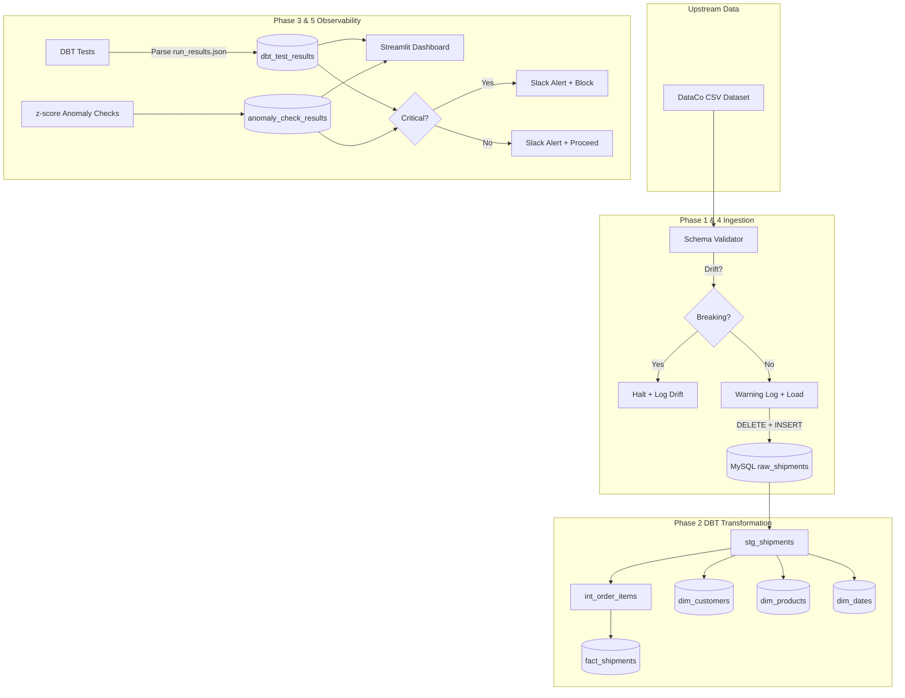

# Shipment Data Quality & Observability Platform

A production-style logistics ingestion and analytics warehouse pipeline designed to manage the DataCo Supply Chain dataset (~180,000 shipment records). This platform demonstrates robust, senior-level data engineering practices by making **data quality and pipeline observability the core product**, rather than an afterthought.

## 🏗️ Architecture



---

## 🔍 Data Quality & Observability (Differentiator)

Most data platform portfolios implement simple constraints (like "not null"). This platform introduces a multi-tiered defense-in-depth checking strategy.

### Checking Hierarchy

1. **Upstream Schema Drift Validation (Pre-Ingest)**: Before loading data into the warehouse, the loader validates the schema against a YAML contract (`ingestion/schemas/shipments.yaml`). Missing columns or type mismatches trigger an immediate **Breaking** halt. New columns trigger a **Warning** log.
2. **Static Business Rules (Post-Build)**: Custom DBT singular tests assert business truth constraints:
   * `assert_ship_date_after_order_date`: Shipments must not precede orders.
   * `assert_no_negative_shipping_quantity`: Quantities must be positive integers.
   * `assert_valid_delivery_status`: Statuses must belong to a configured whitelist.
3. **Statistical Anomaly Detection (Post-Load)**: A custom Python module evaluates metrics against a rolling 30-run history using z-scores:
   * **Row-Count Anomaly**: Catches silent volume drops or spikes (|z| > 3.0).
   * **Metric Drift**: Monitors values like average shipping days and profit fluctuations.
   * **Null-Rate Drift**: Alerts if null percentages on key columns rise, catching incomplete data feeds early.

### Severity & Alerting Tiers

* **`critical`**: Halts downstream mart refresh tasks immediately, logs as `ERROR`, and sends a Slack Alert.
* **`warning`**: Dispatches a Slack alert to the operations channel but lets the pipeline proceed.
* **`info`**: Logged to the time-series audit history for dashboard auditing.

---

## 📈 Real-World Incident Postmortem

### Incident: Upstream `late_delivery_risk` Flag Inconsistency
* **Detection**: Custom test `assert_late_flag_consistency` triggered a warning alert.
* **Scope**: 4,423 records (~2.5% of the total dataset) were flagged.
* **Finding**: The upstream data source provided a boolean flag (`late_delivery_risk`) which contradicted date arithmetic (`days_shipping_real` > `days_shipping_scheduled`). 
* **Root Cause Analysis**: Further query analysis revealed that orders with a delivery status of `Shipping canceled` carried a risk flag of `1` but had a real shipping days value of `0` (since they never shipped). This created a structural misalignment between date arithmetic and business definitions.
* **Resolution**: The flag was downgraded to warning severity in DBT config (`severity='warn'`) to prevent pipeline failure, and the metric was documented in the observability layer as upstream-originated data debt.

---

## 🔄 Idempotency & Recovery

* **Strategy**: The ingestion engine employs a scoped **DELETE + INSERT** pattern for the raw loading stage. Since the source is a full snapshot, this strategy guarantees that running the pipeline multiple times results in exactly **180,519 rows** in `raw_shipments` and `fact_shipments` with zero duplicate metric fanning.
* **Verification**: Step 6 of the orchestration runner validates row counts against expectations, logging anomalies if numbers drift.

---

## 🛠️ Tech Stack & Structure

* **Warehouse**: MySQL 8.0
* **Transformation**: DBT Core (using `dbt-mysql` adapter)
* **Orchestration**: Apache Airflow DAG (with Windows-compatible runner alternative)
* **Dashboard**: Streamlit + Plotly
* **Analysis**: Python (Pandas, SQLAlchemy)

---

## 🚀 Quickstart

### Prerequisites
* MySQL running on `localhost:3306` with database `shipment_observability`.
* Python 3.11+.

### 1. Installation
```bash
pip install -r requirements.txt
```

### 2. Run Ingestion, Transformation & Checks
Run the full pipeline orchestrator:
```bash
python -m orchestration.run_pipeline
```

### 3. Launch Observability Dashboard
```bash
streamlit run dashboard/app.py
```
