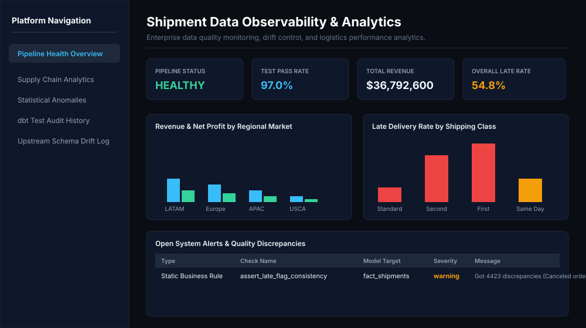
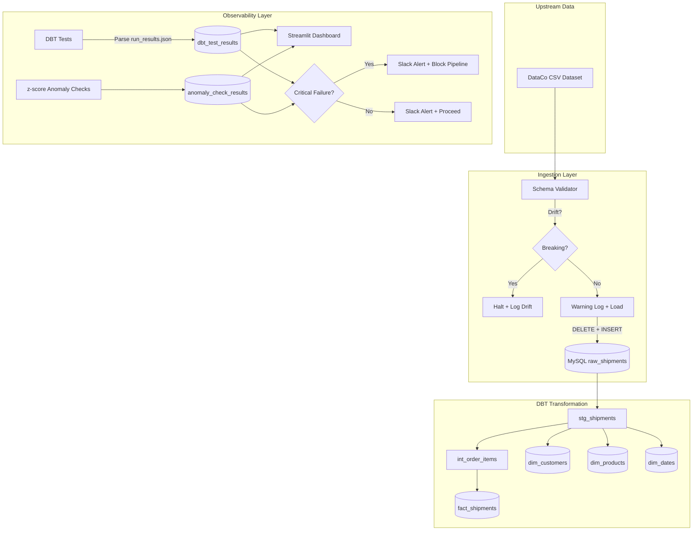
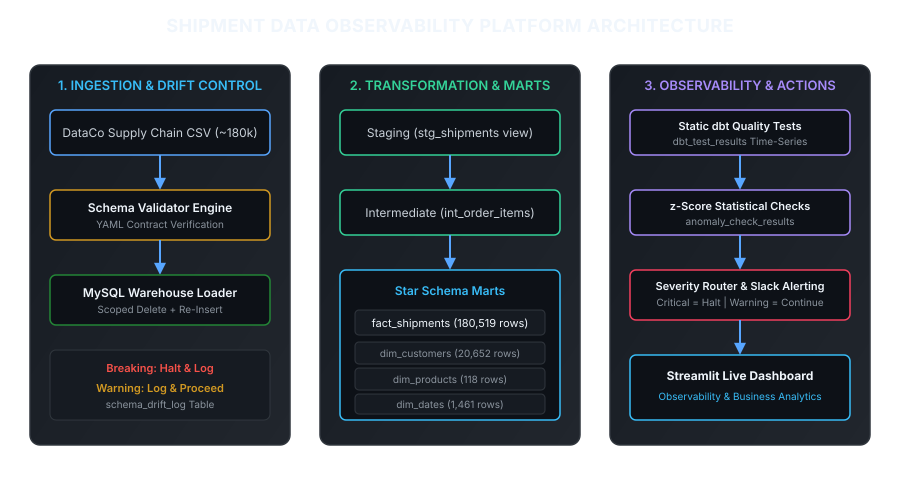

# Shipment Data Quality & Observability Platform


A production-style logistics ingestion and analytics warehouse pipeline designed to manage the DataCo Supply Chain dataset (~180,000 shipment records). This platform demonstrates robust, senior-level data engineering practices by making **data quality and pipeline observability the core product**, rather than an afterthought.

## Live Demo & Observability UI

The pipeline observability dashboard is deployed and can be viewed live:
* **Streamlit Live Dashboard**: [https://shipment-observability-idn2yffuctyed95bhvrvd9.streamlit.app/](https://shipment-observability-idn2yffuctyed95bhvrvd9.streamlit.app/)



## Architecture





---

## Data Quality & Observability (Differentiator)

Most data platform portfolios implement simple constraints (like "not null"). This platform introduces a multi-tiered defense-in-depth checking strategy.

### Checking Hierarchy

1. **Upstream Schema Drift Validation (Pre-Ingest)**: Before loading data into the warehouse, the loader validates the schema against a YAML contract (`ingestion/schemas/shipments.yaml`). Missing columns or type mismatches trigger an immediate **Breaking** halt. New columns trigger a **Warning** log.
2. **Static Business Rules (Post-Build)**: Custom DBT singular tests assert business truth constraints:
   * `assert_ship_date_after_order_date`: Shipments must not precede orders.
   * `assert_no_negative_shipping_quantity`: Quantities must be positive integers.
   * `assert_valid_delivery_status`: Statuses must belong to a configured whitelist.
3. **Statistical Anomaly Detection (Post-Load)**: A custom Python module evaluates metrics against a rolling 30-run history using z-scores:
   * **Row-Count Anomaly**: Catches silent volume drops or spikes (|z| > 3.0).
   * **Metric Drift**: Monitors values like average shipping days and profit fluctuations.
   * **Null-Rate Drift**: Alerts if null percentages on key columns rise, catching incomplete data feeds early.

### Severity & Alerting Tiers

* **`critical`**: Halts downstream mart refresh tasks immediately, logs as `ERROR`, and sends a Slack Alert.
* **`warning`**: Dispatches a Slack alert to the operations channel but lets the pipeline proceed.
* **`info`**: Logged to the time-series audit history for dashboard auditing.

---

## Real-World Incident Postmortem

### Incident: Upstream late_delivery_risk Flag Inconsistency
* **Detection**: Custom test `assert_late_flag_consistency` triggered a warning alert.
* **Scope**: 4,423 records (~2.5% of the total dataset) were flagged.
* **Finding**: The upstream data source provided a boolean flag (`late_delivery_risk`) which contradicted date arithmetic (`days_shipping_real` > `days_shipping_scheduled`). 
* **Root Cause Analysis**: Further query analysis revealed that orders with a delivery status of `Shipping canceled` carried a risk flag of `1` but had a real shipping days value of `0` (since they never shipped). This created a structural misalignment between date arithmetic and business definitions.
* **Resolution**: The flag was downgraded to warning severity in DBT config (`severity='warn'`) to prevent pipeline failure, and the metric was documented in the observability layer as upstream-originated data debt.

---

## Idempotency & Recovery

* **Strategy**: The ingestion engine employs a scoped **DELETE + INSERT** pattern for the raw loading stage. Since the source is a full snapshot, this strategy guarantees that running the pipeline multiple times results in exactly **180,519 rows** in `raw_shipments` and `fact_shipments` with zero duplicate metric fanning.
* **Verification**: Step 6 of the orchestration runner validates row counts against expectations, logging anomalies if numbers drift.

---

## Design Decisions & Architectural Tradeoffs

### Why MySQL for a Portfolio Warehouse?
* **Local & Zero-Cost Reproducibility**: Using MySQL 8.0 allows any engineer or hiring manager to clone the repository and execute `python -m orchestration.run_pipeline` locally without registering for cloud credentials or incurring warehouse costs.
* **dbt Adapter Engineering**: Demonstrates adapter-specific optimization using `dbt-mysql` (e.g., handling MySQL-specific SQL syntax, explicit casting to prevent UNSIGNED arithmetic underflows, and building cross-join date spines to bypass `cte_max_recursion_depth` limits).

### Production Scale Alternatives
In an enterprise environment processing multi-gigabyte or streaming logistics telemetry:
* **Analytical Storage Layer**: Migrate warehouse storage to Snowflake, BigQuery, or Databricks for massively parallel processing (MPP) and column-store efficiency.
* **Object Lakehouse Landing**: Store incoming raw files in Amazon S3 or Google Cloud Storage using Apache Iceberg or Delta Lake formats to enable ACID transactions and time-travel audits prior to warehouse ingestion.
* **Managed Orchestration**: Deploy Airflow on Kubernetes (via AWS MWAA, Astronomer, or Cloud Composer) with infrastructure managed through Terraform.

---

## Tech Stack & Structure

* **Warehouse**: MySQL 8.0
* **Transformation**: DBT Core (using `dbt-mysql` adapter)
* **Orchestration**: Apache Airflow DAG (with Windows-compatible runner alternative)
* **Dashboard**: Streamlit + Plotly
* **Analysis**: Python (Pandas, SQLAlchemy)

---

## Quickstart

### Prerequisites
* MySQL running on `localhost:3306` with database `shipment_observability`.
* Python 3.11+.

### 1. Installation
```bash
pip install -r requirements.txt
```

### 2. Run Ingestion, Transformation & Checks
Run the full pipeline orchestrator:
```bash
python -m orchestration.run_pipeline
```

### 3. Launch Observability Dashboard
```bash
streamlit run dashboard/app.py
```

---

## What I Would Do With More Time

This project deliberately scopes to a local, reproducible environment to demonstrate the observability patterns clearly. The following are concrete, production-grade extensions that are genuinely out of scope for this stage — not hand-waving about hypothetical features:

### 1. Cloud Warehouse Migration (Snowflake or BigQuery)
The MySQL adapter imposes real constraints: no columnar storage, no clustering keys, and no native time-travel for incremental models. Migrating the dbt project to Snowflake or BigQuery would unlock `CLUSTER BY` mart optimization, incremental `MERGE` strategies on `fact_shipments`, and native query result caching — all relevant for a dataset growing to tens of millions of rows. The dbt model SQL is already mostly ANSI-compatible; the adapter swap would be the primary effort.

### 2. Streaming Ingestion via Kafka or Pub/Sub
The current pipeline is batch-oriented: ingest a full CSV snapshot, delete-and-reinsert, run dbt. A production logistics platform processes shipment events in near-real-time. The right extension is to replace the CSV source with a Kafka topic (or GCP Pub/Sub), consume events with a Python consumer that passes each record through the schema validator before writing to a staging table, and trigger dbt incremental model refreshes on a 5-minute schedule via Airflow sensors. This fundamentally changes the latency guarantee from "daily" to "minutes."

### 3. ML-Based Anomaly Detection
The current statistical layer uses z-scores over a rolling 30-run window, which is effective and interpretable, but has a cold-start problem (it takes 30 runs to stabilize) and assumes normally distributed metrics. A genuine upgrade is to train an `IsolationForest` or `Prophet` model on historical pipeline metric time-series and replace the z-score threshold with a model prediction interval. This eliminates manual threshold tuning and adapts automatically to seasonality — for example, shipping volumes spike in November/December and a static z-score would produce false alerts during that period.

### 4. Data Contracts via a Schema Registry
The YAML-based schema contract in `ingestion/schemas/shipments.yaml` is a solid start, but it has no enforcement upstream — the source system can change the schema without triggering a contract violation until the next pipeline run. The production pattern is to register the schema in a centralized Schema Registry (Apache Confluent or AWS Glue Schema Registry), add a version field, and configure the upstream producer to validate against the registry before emitting records. This shifts the detection point from "post-receipt" to "at emission," which eliminates an entire class of silent data debt.
